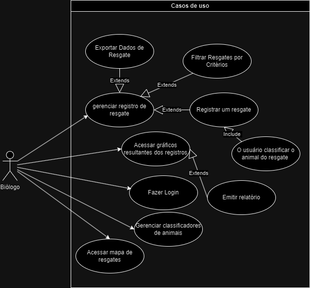
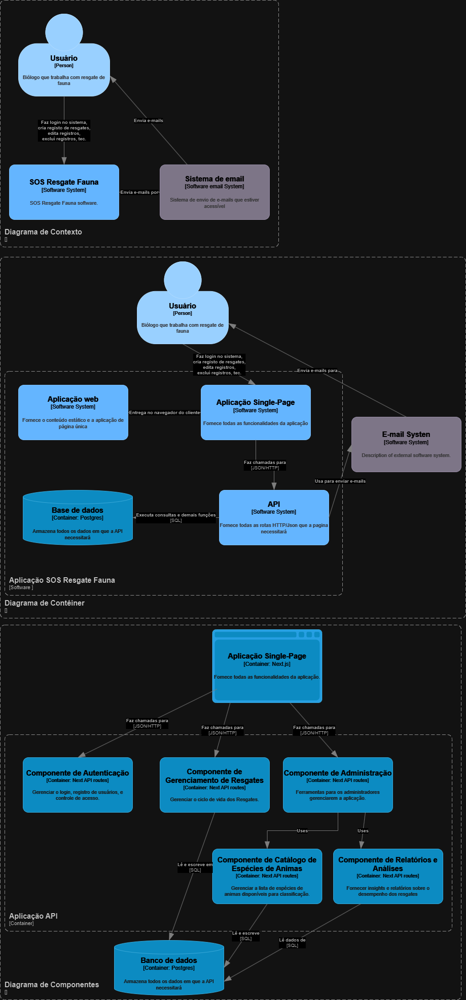

# Resumo do projeto:

O projeto surgiu a partir da participação em um curso de resgate de animais silvestres, durante o qual um aluno teve a oportunidade de interagir com um Biólogo da FUJAMA (Fundação do Meio Ambiente de Jaraguá do Sul). Durante sua palestra, o biólogo mencionou que, ao realizar resgates de animais, preenchia manualmente uma folha de papel para registrar as informações, posteriormente transferindo-as para uma planilha de Excel. Ao identificar essa oportunidade de melhoria, o projeto visa oferecer suporte à instituição, reduzindo a necessidade de retrabalho e proporcionando maior facilidade em seu processo de registro e gestão de dados.

# Introdução

## Contexto:

O contexto do projeto envolve a identificação de uma lacuna no processo de registro e gestão de dados da FUJAMA (Fundação do Meio Ambiente de Jaraguá do Sul), especificamente relacionada aos resgates de animais, como serpentes. Durante um curso de resgate de serpentes, um aluno teve contato com um biólogo da instituição, que compartilhou as dificuldades enfrentadas ao preencher manualmente registros em papel, posteriormente transferindo-os para uma planilha de Excel. Essa prática resultava em retrabalho e dificuldades de gerenciamento. Assim, o projeto visa oferecer uma solução para otimizar e automatizar esse processo, reduzindo o tempo e esforço necessários para a gestão de dados, proporcionando maior eficiência e precisão nas operações de resgate de animais pela FUJAMA.

## Justificativa:

A relevância do projeto para o campo da engenharia de software é evidente, pois propõe uma solução para uma necessidade real de otimização de processos em uma instituição ambiental. Ao substituir o método manual de registro de dados por uma ferramenta automatizada, o projeto demonstra como a aplicação de técnicas de engenharia de software pode aprimorar a eficiência operacional e a precisão das atividades realizadas pela FUJAMA. Além disso, a implementação de um sistema de gestão de dados permite uma melhor organização e análise das informações coletadas durante os resgates de animais, contribuindo para uma tomada de decisão mais informada e estratégica por parte da instituição. Dessa forma, o projeto não apenas atende a uma necessidade específica da FUJAMA, mas também ilustra como a engenharia de software pode ser aplicada de forma prática e benéfica em contextos do mundo real, demonstrando sua relevância e impacto no campo.

## Objetivos:

O objetivo principal do projeto é desenvolver uma solução de software que automatize e otimize o processo de registro de dados relacionados aos resgates de animais realizados pela FUJAMA. Isso inclui a criação de um sistema que permita o registro eficiente das informações relevantes durante os resgates, eliminando a necessidade de preenchimento manual de formulários em papel e sua posterior transferência para planilhas de Excel.

## Além do objetivo principal, os objetivos secundários incluem:

- Facilitar a coleta e o armazenamento de dados precisos e completos sobre os resgates de animais, incluindo informações como espécie, localização, condição, e outras observações relevantes.

- Implementar funcionalidades que permitam a análise e a visualização dos dados coletados, possibilitando insights valiosos para a FUJAMA sobre padrões de resgate, áreas de maior incidência, necessidades de recursos, entre outros aspectos.

- Garantir a usabilidade e a acessibilidade do sistema, de modo que os usuários da FUJAMA possam adotá-lo facilmente em suas operações diárias, sem a necessidade de treinamento extensivo.

- Assegurar a segurança e a integridade dos dados, implementando medidas adequadas de proteção e backup para evitar perda ou violação de informações sensíveis.

# Descrição do Projeto

## Tema do Projeto:

O tema do projeto é o desenvolvimento de um sistema web para a FUJAMA (Fundação do Meio Ambiente de Jaraguá do Sul) que visa otimizar o processo de registro de dados relacionados aos resgates de animais. O produto a ser desenvolvido consistirá em uma aplicação web acessível através da internet, onde os funcionários e colaboradores da FUJAMA poderão registrar informações sobre cada resgate de forma rápida e eficiente.

A aplicação web terá uma interface intuitiva e amigável, permitindo aos usuários preencherem campos específicos com detalhes sobre o resgate, como espécie do animal, localização, condição de saúde, data e hora do resgate, entre outros dados relevantes. Além disso, o sistema web incluirá funcionalidades para a análise e visualização dos dados coletados para facilitar a interpretação e utilização das informações.

Por meio do desenvolvimento desta aplicação web, a FUJAMA poderá modernizar e agilizar seu processo de registro de resgates de animais, reduzindo a dependência de formulários em papel e planilhas manuais. Isso não apenas aumentará a eficiência operacional da instituição, mas também melhorará a qualidade e a precisão dos dados coletados, permitindo uma gestão mais eficaz dos recursos e a implementação de estratégias mais adequadas para a conservação da vida selvagem na região de Jaraguá do Sul.

[Link para a ficha](https://drive.google.com/file/d/1-acw-I-E7JE1rDgJuwsOPRSGw0Mi6z1J/view?usp=sharing)

## Problemas a Resolver:

Ineficiência no processo de registro de resgates de animais: Atualmente, a FUJAMA enfrenta dificuldades devido ao preenchimento manual de formulários em papel durante os resgates de animais. Isso resulta em um processo moroso e propenso a erros, além de exigir tempo adicional para a transferência desses dados para planilhas de Excel, o que aumenta o retrabalho e diminui a eficiência operacional.

Dificuldade de gestão e análise de dados: Com a atual abordagem manual, a FUJAMA enfrenta desafios na organização e análise dos dados coletados durante os resgates de animais. A falta de uma ferramenta adequada para gerenciar e visualizar essas informações dificulta a identificação de padrões, tendências e necessidades emergentes, prejudicando a capacidade da instituição de tomar decisões informadas e estratégicas.

Falta de integração e acessibilidade: A ausência de um sistema centralizado e acessível pela internet dificulta o compartilhamento e a colaboração entre os membros da equipe da FUJAMA. Isso pode resultar em informações desatualizadas ou incompletas, bem como dificuldade na comunicação entre os envolvidos nos resgates de animais.

## Limitações:

Embora o projeto busque resolver os principais problemas relacionados ao registro e gestão de resgates de animais pela FUJAMA, existem algumas limitações importantes a serem consideradas:

-Infraestrutura física: O projeto não abordará questões relacionadas à infraestrutura física necessária para realizar os resgates de animais, como veículos, equipamentos de captura, e instalações para abrigo temporário ou tratamento veterinário dos animais resgatados. Estes são aspectos que não estão diretamente relacionados ao registro de dados, mas que são igualmente importantes para o sucesso das operações de resgate.

-Capacitação e treinamento: O projeto não incluirá iniciativas para treinamento ou capacitação de pessoal envolvido nos resgates de animais. Embora a eficiência do processo de registro de dados possa ser melhorada por meio de treinamento adequado, isso não será abordado diretamente pelo projeto.

-Atividades de conservação além dos resgates de animais: Embora o projeto se concentre nos resgates de animais, não abordará outras atividades de conservação da vida selvagem realizadas pela FUJAMA, como programas de educação ambiental, monitoramento de populações de animais, ou gestão de áreas protegidas.

# Especificação Técnica

## 1. Requisitos de Software:

Desenvolvimento de uma aplicação web responsiva, acessível através de navegadores web convencionais.

Interface de usuário intuitiva e amigável para facilitar o registro de dados sobre os resgates de animais.

Funcionalidades de login e controle de acesso para garantir a segurança e a privacidade das informações.

Capacidade de registrar informações detalhadas sobre cada resgate, incluindo espécie do animal, localização, data e hora do resgate, condição do animal, entre outros.

Ferramentas de validação de dados para garantir a precisão e integridade das informações inseridas.

Funcionalidades de pesquisa e filtragem para facilitar o acesso e a recuperação de dados específicos.

Capacidade de exportar dados para outros formatos, como CSV ou PDF, para fins de relatório e análise.

## 2. Protocolos:

Utilização de protocolos de segurança padrão, como HTTPS, para garantir a proteção dos dados durante a transmissão.

Implementação de protocolos de autenticação e autorização para controlar o acesso aos dados do sistema.

Utilização de protocolos de comunicação compatíveis com os requisitos de integração com outros sistemas da FUJAMA, se necessário.

## 3. Algoritmos:

Algoritmos de validação de dados para garantir a consistência e integridade das informações inseridas pelos usuários.

Algoritmos de busca e filtragem eficientes para facilitar a recuperação de dados relevantes.

Algoritmos de geração de relatórios e análises para identificar padrões e tendências nos dados coletados.

## 4. Procedimentos:

Procedimentos de desenvolvimento de software baseados em metodologias ágeis, como Scrum ou Kanban, para garantir um processo de desenvolvimento iterativo e colaborativo.

Procedimentos de teste rigorosos, incluindo testes de unidade, integração e aceitação, para garantir a qualidade e confiabilidade do sistema.

Procedimentos de implementação e implantação para garantir uma transição suave para o novo sistema e minimizar o tempo de inatividade.

## 5. Formatos de Dados:

-Utilização de formatos de dados estruturados, como JSON, para armazenar e transmitir informações sobre os resgates de animais.

-Adoção de formatos de dados interoperáveis para facilitar a integração com outros sistemas da FUJAMA, se necessário.

# 3.1. Requisitos de Software

## Lista de Requisitos:

| Requisitos Funcionais (RF)                                            | Requisitos Não-Funcionais (RNF)    |
| --------------------------------------------------------------------- | ---------------------------------- |
| Gerenciar os registros provenientes dos resgates.                     | Disponibilidade offline.           |
| Permitir que o usuário classifique o animal do resgate.               | Usabilidade em um celular simples. |
| Permitir usuário listar resgates com diversos filtros.                | Autenticação simples.              |
| Permitir o usuário de modificar os tipos de espécies pré-cadastrados. | Aplicação PWA.                     |
| Mapa de onde foi feito os resgates.                                   |                                    |
| Relatório mensal dos resgates feitos filtrado por espécie.            |                                    |

# Representação dos Requisitos:

## 3.2. Considerações de Design

Visão Inicial da Arquitetura: Descrição dos componentes principais e suas interconexões.

| **Componentes**                                                                                |
| ---------------------------------------------------------------------------------------------- |
| **Componente de Autenticação**                                                                 |
| **Responsabilidade:** Gerenciar o login, registro de usuários, e controle de acesso.           |
| **Funcionalidades:**                                                                           |
| - Registro de novos usuários.                                                                  |
| - Login e logout.                                                                              |
| - Recuperação de senha.                                                                        |
|                                                                                                |
| **Componente de Gerenciamento de Resgates**                                                    |
| **Responsabilidade:** Gerenciar o ciclo de vida dos Resgates.                                  |
| **Funcionalidades:**                                                                           |
| - Criação de novos registros de Resgates.                                                      |
| - Edição e atualização de registros de Resgates.                                               |
| - Atribuição de registros de Resgates a técnicos e ou analistas.                               |
| - Controle de status dos registros de Resgates (aberto, em andamento, resolvido, fechado).     |
| - Priorização e categorização de registros de Resgates.                                        |
|                                                                                                |
| **Componente de Catálogo de Espécies de Animais**                                              |
| **Responsabilidade:** Gerenciar a lista de espécies de animais disponíveis para classificação. |
| **Funcionalidades:**                                                                           |
| - Adição, edição e exclusão das espécies.                                                      |
| - Categorização das espécies.                                                                  |
| - Pesquisa e filtragem das espécies.                                                           |
|                                                                                                |
| **Componente de Notificações**                                                                 |
| **Responsabilidade:** Gerenciar a comunicação com os usuários.                                 |
| **Funcionalidades:**                                                                           |
| - Envio de e-mails.                                                                            |
| - Gestão de preferências de notificação do usuário.                                            |
| **Componente de Relatórios e Análises**                                                        |
| **Responsabilidade:** Fornecer insights e relatórios sobre o desempenho dos resgates.          |
| **Funcionalidades:**                                                                           |
| - Análise de comportamento dos animais.                                                        |
| - Monitoramento da fauna local.                                                                |
| - Geração de relatórios.                                                                       |
|                                                                                                |
| **Componente de Administração**                                                                |
| **Responsabilidade:** Ferramentas para os administradores gerenciarem a aplicação.             |
| **Funcionalidades:**                                                                           |
| - Painel administrativo para gerenciar usuários, e demais componentes do sistema.              |
| - Controle de acesso administrativo.                                                           |
| - Monitoramento de atividades.                                                                 |
| - Configuração e ajustes do sistema.                                                           |

| **Interconexões**                                                                                                                                                            |
| ---------------------------------------------------------------------------------------------------------------------------------------------------------------------------- |
| O **Componente de Notificações** pode ser acionado pelo **Componente de Gerenciamento de Resgates** para enviar uma notificação ao usuário quando o status do resgate mudar. |
| O **Componente de Relatórios e Análises** pode acionar o **Componente de Gerenciamento de Resgates** para gerar diversos relatórios.                                         |
| O **Componente de Administração** pode acionar o **Componente de Catálogo de Espécies de Animais** para fazer alguma alteração.                                              |

## Padrões de Arquitetura: Indicação de padrões específicos utilizados.

Devido ao tamanho do projeto e sua aplicabilidade ser bem específica foi tomado a decisão de se fazer o padrão monolítico para facilitar a manutenção geral do sistema e diminuir a complexidade de ter que lidar com diversos serviços e módulos separados. Para a melhor administração do código será usado monorepo, assim o CI/CD irá ser único e facilitar a implementação de novas funcionalidade e facilitar a correções de bugs mais agilmente.

## Modelos C4: Detalhamento da arquitetura em níveis: Contexto, Contêineres, Componentes.

# 3.3. Stack Tecnológica

# Linguagens de Programação:

Back-end: será utilizado Node.js pois sua curva de aprendizagem é pequena, a aplicação não deverá ser uma ordem de grandeza gigante, a experencia do aluno em desenvolvimento de aplicações em node de 2 anos, sua facilidade para a criação de aplicações web, ele será implementado junto ao repositório front-end, isso devido as novas atualizações do Next API Routes, que possibilita a criação de uma API dentro ao projeto, formando assim um monorepo.

Front-end: será usado o Next.js, devido sua plataforma de implementação, Vercel, ter preços atrativos e ter uma facilidade de implementação acima da média. E devido a sua grande documentação e conteúdo de desenvolvimento, o que contribui bastante para que a tecnologia tenha mais adoção e por consequência mais robustez

Frameworks e Bibliotecas: Frameworks e bibliotecas principais a serem utilizados.
| **Frameworks** | **Bibliotecas** |
|-------------------------|----------------------------------------|
| **Next.js** | **Sequelize, Prisma, etc. (ORMs)** |
| _Motivo:_ O uso do Next.js em um projeto que utiliza a biblioteca React traz diversos benefícios significativos. Primeiramente, o framework permite a renderização das páginas no lado do servidor (Server-side Rendering - SSR), o que melhora o desempenho e a experiência do usuário, especialmente em sites com conteúdo estático ou semi-estático. Essa característica também é extremamente útil para a otimização de mecanismos de busca (SEO). Além disso, o Next.js possui um sistema de roteamento file-based intuitivo e simplificado, evitando a complexidade de gerenciamento de rotas em aplicações React tradicionais. | _Motivo:_ Utilizar bibliotecas de ORM (Object-Relational Mapping) em um projeto traz diversos benefícios significativos. Em primeiro lugar, as bibliotecas de ORM abstraem a complexidade do acesso e manipulação direta de um banco de dados, permitindo que os desenvolvedores trabalhem com objetos e classes de maneira mais natural e intuitiva, em vez de terem que lidar diretamente com consultas SQL. Isso simplifica muito o processo de interação com o banco de dados, reduzindo a quantidade de código necessária e tornando o desenvolvimento mais rápido e eficiente. Além disso, as bibliotecas de ORM geralmente oferecem recursos avançados, como migrações de esquema, validação de dados, cache e otimização de consultas, que ajudam a garantir a integridade e o desempenho do banco de dados, mesmo em aplicações complexas. |
| **React** | **Bibliotecas para manipular coordenadas geográficas** |
| _Motivo:_ Um motivo geral para usar o React em um projeto é a sua eficiência na construção de interfaces de usuário interativas e responsivas. O React é uma biblioteca Javascript de código aberto que permite criar componentes reutilizáveis e construir interfaces de usuário de forma declarativa. | _Motivo:_ Facilitar a iteração com os possíveis mapas que serão integrados ao sistema. |
| **Cypress** | **Auth.js** |
| _Motivo:_ Framework de testes que permite criar testes unitários e de integração. | _Motivo:_ Autenticação que suporta vários provedores, facilitando a implementação de login seguro. |

| **Utilitários**                                                                                                                                                                                     |
| --------------------------------------------------------------------------------------------------------------------------------------------------------------------------------------------------- |
| **ESLint**                                                                                                                                                                                          |
| _Motivo:_ Permite estabelecer e impor padrões de código consistentes, detectar erros, melhorar a qualidade geral do código e automatizar a análise de código durante o processo de desenvolvimento. |
| **Prettier**                                                                                                                                                                                        |
| _Motivo:_ Formatador de código que ajuda a manter um estilo consistente, ajudando a manter o código limpo e legível.                                                                                |

## Ferramentas de Desenvolvimento e Gestão de Projeto:

No projeto de desenvolvimento do sistema, será utilizado o método Kanban em conjunto com o software Jira para gerenciar as tarefas e o progresso do projeto. O Kanban é uma abordagem ágil que utiliza um quadro visual para controlar as tarefas em diferentes estágios, enquanto o Jira é uma ferramenta de gestão de projetos amplamente utilizada que fornece recursos avançados de acompanhamento e colaboração. Essa combinação permitirá uma gestão eficiente das tarefas, facilitando a visualização, atribuição e acompanhamento do progresso do projeto.

[Link para o board](https://portfoliocatolicasc.atlassian.net/jira/software/projects/KAN/boards/1)

# 3.4. Considerações de Segurança

Análise de possíveis questões de segurança e como mitigá-las.

| **Segurança**                                                                                                                                                                                                                                                                                                                                                                                                                                                         |
| --------------------------------------------------------------------------------------------------------------------------------------------------------------------------------------------------------------------------------------------------------------------------------------------------------------------------------------------------------------------------------------------------------------------------------------------------------------------- |
| **Autenticação e controle de acesso:** É fundamental garantir que apenas usuários autorizados possam acessar o sistema. Isso envolve o desenvolvimento de um mecanismo de autenticação robusto, como autenticação de dois fatores, senhas fortes e proteção contra ataques de força bruta. Além disso, é importante implementar um controle de acesso adequado, definindo permissões para diferentes níveis de usuários e restringindo o acesso a recursos sensíveis. |
| **Proteção de dados:** Os dados do sistema podem conter informações confidenciais dos usuários ou da organização. É necessário garantir que esses dados sejam armazenados e transmitidos de forma segura. Isso pode envolver o uso de criptografia para proteger os dados em repouso e em trânsito, além de medidas adequadas de segurança para proteger o banco de dados contra acesso não autorizado.                                                               |
| **Prevenção de ataques de injeção:** É importante mitigar a possibilidade de ataques de injeção, como injeção de SQL e injeção de código. Isso pode ser alcançado por meio do uso de consultas parametrizadas ou prepared statements, o que ajuda a evitar a execução de comandos maliciosos inseridos em campos de entrada.                                                                                                                                          |
| **Gerenciamento de sessões:** Caso o sistema exija autenticação, é importante estabelecer um mecanismo seguro para gerenciar sessões de usuários. Isso envolve a geração de identificadores de sessão exclusivos, a expiração automática de sessões inativas e a proteção contra ataques de sessão, como a interceptação de cookies.                                                                                                                                  |
| **Auditoria e registros de segurança:** Implementar recursos de auditoria e registros de segurança pode ajudar a identificar atividades suspeitas e fornecer uma trilha de auditoria para investigações posteriores. Isso pode incluir o registro de eventos relevantes, como logins bem-sucedidos/fracassados, alterações de permissões e acesso a recursos críticos.                                                                                                |
| **Testes de segurança:** É recomendável realizar testes de segurança, como testes de penetração e testes de vulnerabilidade, para identificar possíveis falhas de segurança no sistema. Esses testes podem ajudar a descobrir vulnerabilidades antes que o sistema seja implantado em produção, permitindo que sejam corrigidas adequadamente.                                                                                                                        |
